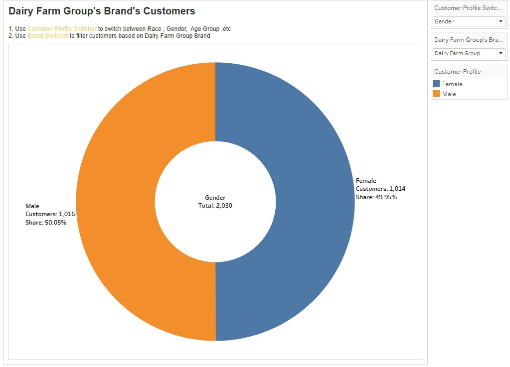
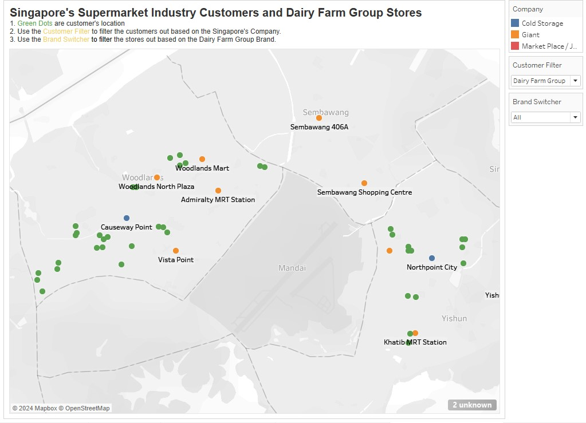

## [Tableau Workbook Link](https://public.tableau.com/views/HomeAssignmentV4/StoreLocations?:language=en-US&publish=yes&:sid=&:display_count=n&:origin=viz_share_link)

## Observations
### Q1.a. Who are Dairy Farm Group's customers?

People who have answered `Giant`, `Cold Storage` or `MarketPlace / Jasons` to the Q2_1 or Q2_2 or Q2_3 or Q2_4 or Q2_5 or Q2_6 are Dairy Farm Group’s customers.

```
IF 
[Q2 1] = "Giant" OR [Q2 1] = "Cold Storage" OR [Q2 1] = "Market Place / Jasons"
OR [Q2 2] = "Giant" OR [Q2 2] = "Cold Storage" OR [Q2 2] = "Market Place / Jasons"
OR [Q2 3] = "Giant" OR [Q2 3] = "Cold Storage" OR [Q2 3] = "Market Place / Jasons"
OR [Q2 4] = "Giant" OR [Q2 4] = "Cold Storage" OR [Q2 4] = "Market Place / Jasons"
OR [Q2 5] = "Giant" OR [Q2 5] = "Cold Storage" OR [Q2 5] = "Market Place / Jasons"
OR [Q2 6] = "Giant" OR [Q2 6] = "Cold Storage" OR [Q2 6] = "Market Place / Jasons"
THEN TRUE
ELSE FALSE
END

```

Use `Customer Profile Switcher` to switch the customer profile.

Customer Profiles
1. Gender
2. Race
3. Household Income
4. Age Group
5. House Type
6. Work Status

#### Tab Name:- `Dairy Farm Group's Customer`


#### Tab Name:- `Pie Chart Dairy Farm Group's Customers`


Q1.b. Where do Dairy Farm Group's customers reside based on each of its brands? 

#### Tab Name:- `Dairy Farm Group's Customers Location`
The are and color of the circle represents the strength of populations in that particular Pincode area.

Use Filter
1. Region
2. Gender
3. Race
4. Age Group
5. Work Status
6. Household Income
7. House Type
8. Brand Switcher
to filter the customers out.

`Brand Switcher` filters the customer based on which Dairy Farm Group Brand store they visit.


### Q1.c. What is the profile of its customers for each of its brands?

1. Use `Brand Switcher` to filter the customer based on which Dairy Farm Group Brand store they visit.
2. Use `Customer Profile Switcher` to switch the customer profile.
3. Use `Customer %`. Note:- 0.01 = 1%


#### Tab Name:- `Pie Chart Dairy Farm Group's Brand's Customers`


#### Tab Name:- `Tabular View 1.0 Dairy Farm Group's Brand's Customers`


#### Tab Name:- `Tabular View 2.0 Dairy Farm Group's Brand's Customers`


### Q1.d. Are the customer profiles different for each brand?
#### Tab Name:- `Tabular View 2.0 Dairy Farm Group's Brand's Customers`
Note:- More Brand Filters are available in the notebook. 

1. Customers who shop at Giant Only
    

2. Customers who shop at Cold Storage Only
    

3. Customers who shop at MarketPlace/Jasons Only
    

### Q2.a. Who are Dairy Farm Group's competitors?

Singapore's Supermarket Industry has following major player
1. NTUC Fairprice
2. Dairy Farm Group
3. Sheng Siong
4. Prime Mart

Note:- There are also poeple in the survey who have not shopped at any of these company stores in past 3 months. Use `Customer filter`  -->`None` for them. 

The Competitors of Dairy Farm Group will be having customers shopping from either
1. NTUC
2. Sheng Siong
3. Prime Mart 
Only but not from Dairy Farm Group.

```
([Customer of NTUC Fairprice] OR [Customer of Prime Mart] OR [Customer of Sheng Siong]) AND [Customer of Dairy Farm Group] = FALSE
```

#### Dashboard Tab Name:- `Singapore's Supermarket Industry`


#### Tab Name:- `Singapore's Supermarket Industry Customers`


#### Tab Name:- `Pie Chart Singapore's Supermarket Industry Customers`


#### Tab Name:- `Tabular View 1.0 Singapore's Supermarket Industry Customers based on Company`


#### Tab Name:- `Tabular View 2.0 Singapore's Supermarket Industry Customers based on Company`


### Q2.b. Which customers are its competitors currently serving?

#### Tab Name:- `Dairy Farm Group's Competitors 3.0`


#### Tab Name:- `Pie Chart Dairy Farm Group's Competitors`


#### Tab Name:- `Tabular View Dairy Farm Group's Competitors`


### Q2.c. What is the customer profile for each of its competitors?
Note:- More Company Brand Filters are available in the notebook.

### Tab Name:- `Tabular View 2.0 Singapore's Supermarket Industry Customers based on Company`
1. NTUC Fairprice Customer
    

2. Sheng Siong
    

3. Prime Mart
    
    

### Q3.a. Is there a difference between where Dairy Farm Group stores are located and where its customers reside? 

1. Green Dots are customer's location
2. Use the `Brand Switcher` to filter the customers out based on the Dairy Farm Group Brand.
3. Use the `Store's Brand` Filter to filter the stores out based on the Dairy Farm Group Brand.

### Tab Name:- `Dairy Farm Group Stores`


### Tab Name:- `Dairy Farm Group's Brand's Customers and Stores`


### Tab Name:- `Singapore's Supermarket Industry Customers and Dairy Farm Group Stores`


### Q3.b. Given the current distribution of stores (see the required data), should Dairy Farm Group open more new stores in the northern region?

Dairy Farm Group



Dairy Farm Group Competitores


Dairy Farm Group should not open new stores in North Region rather
- Close 
    1. Sembawang 406A
    2. Sembawang Shopping Centre

- Relocate 
    1. Causeway Point
    2. Vista Point
    3. Admiralty MRT Station
